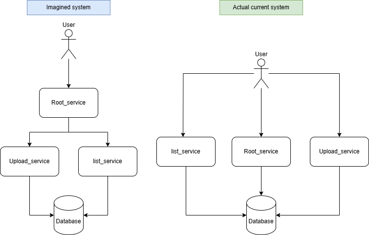

https://github.com/Skymtes/assignment_build_something/

This is an application for storing information in a Cassandra database and then retrieving the information.
The first idea for this application was to be a RAG (Retrieval Augmented Generation) system.
The complexity of a RAG system was too much and downscaled to only be about storing files in the database.
The issues encountered with manipulating files and being able to send files and/or paths caused further dowscaling.

The root_service is the landing page found on port 8000 and also does the initial setup of the Cassandra database with creating a keyspace and a table required to store information.
I tried doing this with an init.sql file but did not get it to work and instead chose to do this since it was most likely faster.
The root_service needs to be called first thing after starting the application for the first time, this is not ideal, however after the initiation this service can be ignored for now.
The root_service is thought to be the only access point between the user and the system when in production. 
The root_service would be responsible for calling the other services and act as a proper load balancer.

The upload_service is where you upload information to the database. It can be reached on 8001/upload/{insert the information to store here}.
Sending the information in this way is crude and would need improvement before being in production.

The list_service is reached on 8002/list and just retrieves all the information stored in the database and sends it back.

All the services except for the database are currently configured as load balancers to enable easy access from the outside.
The only service that should be a load balancer in practice is the root_service to enable easy scaling of the application.
The upload_service and list_service are completely independent and should be able to scale infinitely except for the required connection to the database.
The database should also be infinitely scalable but that is something to investigate further.

Right now, I do not believe that anything is done to keep the services up at all times. If a service goes down then it will stay down.
I only create a single replica right now which should probably be increased if the system would be actually used. 
This could most likely be fixed by restarting the service or just starting a new one instead but if the service goes down in the middle of uploading something due to an error or similar then this could cause problems.
I tried to protect the system from SQL injections in the code however this is still a cause for concern.
Double checking the upload function or having security check for this before the actual execution could be good.
I have set the database to be small which will need to be changed before production deployment.
Right now all the services are reachable from the outside which can be a security risk so making root_service the only access point and having proper security checks would be important.
I have also not included any authorisation in the database but this would also need to be added.

Simon Lindholm
